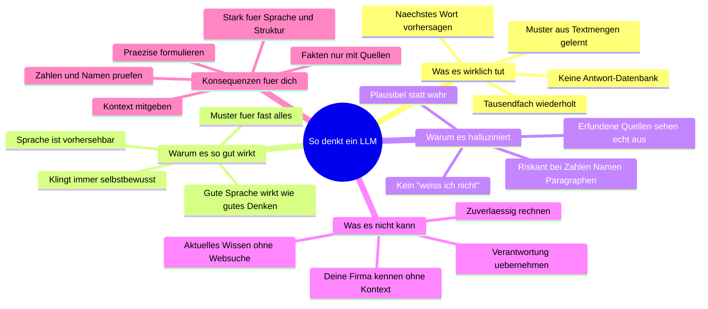

# Mindmap: So denkt ein LLM

Das mentale Modell aus der Lektion „Was ist KI – und was nicht?" auf einer Seite. Nutze die Outline zum Wiederholen (funktioniert direkt in Obsidian/Notion als einklappbare Liste) – der Mermaid-Block darunter rendert dieselbe Struktur als visuelle Mindmap.

## Die Mindmap als Outline

- **So denkt ein LLM**
    - **Was es wirklich tut**
        - Sagt das wahrscheinlichste nächste Wort (Token) voraus – nichts anderes
        - Wiederholt das tausendfach, bis ein Text dasteht
        - Kein Nachschlagen: Es gibt keine Datenbank mit „richtigen Antworten" im Hintergrund
        - Gelernt aus riesigen Textmengen: welche Wörter in welchem Zusammenhang typisch sind
    - **Warum es so gut wirkt**
        - Sprache ist erstaunlich vorhersehbar – wer Millionen Offerten, Mails und Protokolle gesehen hat, trifft den Ton
        - Es hat Muster für fast alles: Vertragsklauseln, Excel-Formeln, Kondolenzschreiben
        - Es formuliert immer flüssig und selbstbewusst – auch wenn der Inhalt falsch ist
        - Unser Gehirn schließt von guter Sprache auf gutes Denken. Das ist die Falle.
    - **Warum es halluziniert**
        - „Plausibel" und „wahr" sind für das Modell dasselbe Kriterium: Wahrscheinlichkeit
        - Bei Wissenslücken gibt es kein „weiß ich nicht" – es wird das Wahrscheinlichste erfunden
        - Besonders riskant: Zahlen, Namen, Daten, Gesetzesartikel, Quellenangaben
        - Beispiel: Ein OR-Artikel, der perfekt formatiert ist, aber nicht existiert
    - **Was es nicht kann**
        - Wissen nach dem Trainings-Stichtag (außer mit Websuche)
        - Zuverlässig rechnen – es rät Zahlen, statt zu rechnen (außer mit Werkzeugen)
        - Deine Firma, deine Kunden, deine Preise kennen – außer du gibst sie im Kontext mit
        - Verantwortung übernehmen: Es haftet nicht, wenn die Offerte falsch ist. Du schon.
        - Zwischen zwei Chats etwas über dich lernen (Training ist längst abgeschlossen)
    - **Konsequenzen für deine Nutzung**
        - Gib Kontext mit: Preisliste rein → Zahlen stimmen. Kein Kontext → Zahlen erfunden
        - Prüfe alles, was nachprüfbar ist: Zahlen, Namen, Paragraphen, Zitate
        - Nutze es für Sprache und Struktur (Entwürfe, Zusammenfassungen, Umformulieren) – da ist es stark
        - Nutze es nicht als Faktenquelle ohne Quellen – dafür Websuche oder Perplexity
        - Formuliere präzise: Das Modell vervollständigt deinen Prompt – je klarer der Anfang, desto besser das Ende

## Dieselbe Struktur als Mermaid-Mindmap

## Merksatz

> Ein LLM ist kein Lexikon, das antwortet – es ist eine Autovervollständigung, die aus Millionen Texten gelernt hat, wie eine gute Antwort **aussieht**. Deshalb ist es brillant im Formulieren und unzuverlässig im Faktenwissen. Plane beides ein.

---
*AI Academy — academy.madkourmedia.com*
